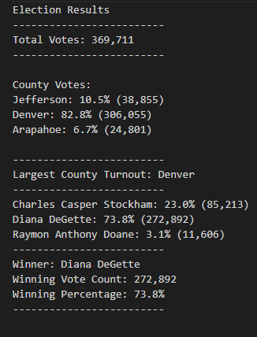

# Election Analysis With Python

## Overview of Election Audit
Tom and Tom's manager, Seth, have tasked us with a few  data values they need calculated for an election audit coming from  voters' Ballot ID, county they are voting in, and the candidate they voted for. We are originally tasked with finding five data values that we need to retrieve from the whole data set. These consisted of: The total number of votes cast, a complete list of candidates who received votes, the percentage of votes each candidate won, the total number of votes each candidate won, and the winner of the election based on popular vote. From here, Seth and Tom requested further analysis, including: the voter turnout of each county, the percentage of votes from each county out of the total votes, and the county with the highest turn out. Below are our results for Seth and Tom!

## Election Audit Results

## Election Audit Summary

